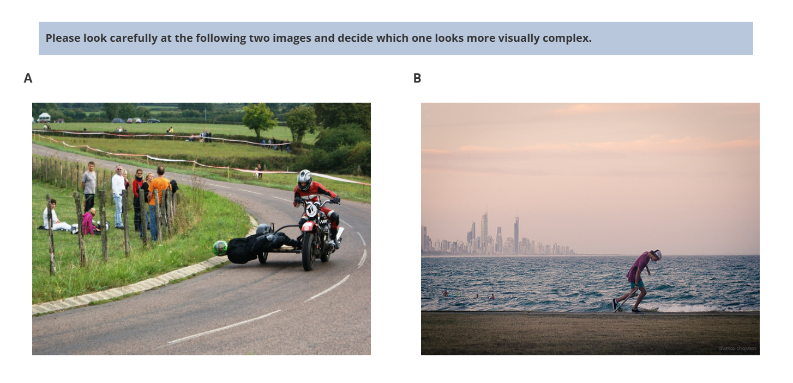

# Visual Complexity Perception Experiment

## Overview
This experiment explores how participants perceive **visual complexity** in images. Built using [jsPsych](https://www.jspsych.org/), the experiment allows participants to compare image pairs and select which one appears more visually complex. The results aim to enhance our understanding of human perception and its applications in fields like computer vision and design.

---

## How It Works

At the beginning of the experiment, participants receive a brief introduction outlining the study's objectives and procedures. They are subsequently presented with example comparisons and instructed to select the image they perceive as more visually complex. The example images are stored in the `images/examples/` directory.

The experiment consists of 200 image pairs, supplemented by three additional attention checks to ensure participant engagement. In total, 30 experimental sessions are conducted, yielding 6,000 individual comparisons. The comparison data, along with session identifiers, are stored in `images/comparisons.csv`, while the image files are located in the `images/sample/` directory. `-1.jpg` and `0.jpg` are actually the same image, with the latter having a text overlay to ensure participants are paying attention.

Following the image comparison task, participants complete a brief questionnaire regarding their decision-making process. Upon conclusion of the experiment, all collected data is stored as a CSV file in the `data/` directory for further analysis.

In addition to the collected data, three supplementary text files are generated within the `data/` directory. These files provide metadata on session statuses: `occupied_sessions.txt` contains a list of sessions currently in progress, `completed_sessions.txt` records sessions that have been successfully completed, and `session_log.txt` documents the start time and, where applicable, the end time of both completed and ongoing sessions.

---

To run the experiment, first, install a web server using a tool such as [XAMPP](https://www.apachefriends.org/). Once the server is set up, copy the experiment files into the web server's root directory. Ensure that the necessary images are placed in the appropriate folders: example images should be stored in `images/examples/`, while task images should be placed in `images/sample/`. To initiate the experiment, open http://localhost/index.html in a web browser. Throughout the experiment, participant responses are automatically recorded and saved as CSV files in the `data/` directory for further analysis.

As an example output of the experiment (coming from our visual complexity experiment), the `data/` directory contains a CSV file named `example.csv`. This file includes the following columns:

* `start_time`, `end_time`: The timestamps indicating when the participant started and completed the session.
* `subject_id`, `session_id`: Unique identifiers for the participant (assigned randomly in `complexity.js`) and the session.
* `comparison_sequence`: A semicolon-separated list of image pairs shown during the experiment, with each pair represented by their image IDs.
* `comparison_responses`: The participant’s choices for each image pair, recorded as 1 or 0, indicating which image was perceived as more visually complex.
* `response_times`: The time taken (in milliseconds) for each decision, corresponding to the order in comparison_sequence.
* `selected_images`: The actual image IDs chosen as more complex for each comparison.
* `strategy_response`: Participant feedback on their decision-making strategy.
* `most_complex_response`: The participant’s thoughts on which images were particularly complex.
* `challenging_pairs_response`: Notes on pairs that were difficult to evaluate.
* `additional_comments`: Any extra feedback provided by the participant.

---

## Contact
For questions or issues, contact me at [karahansaritas@gmail.com](mailto:karahansaritas@gmail.com).
